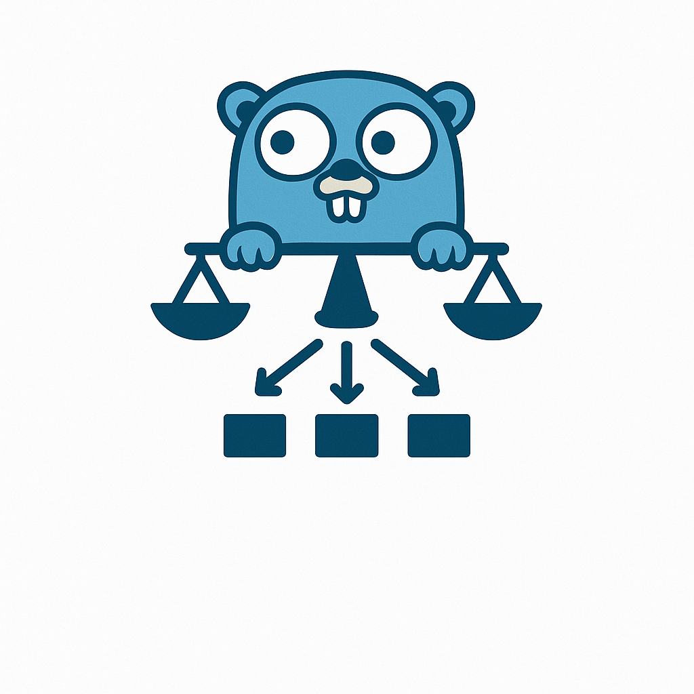

# Go Load Balancer

<p align="center">
  
</p>

[](https://goreportcard.com/report/github.com/The-iyed/go-load-balancer)
[](https://opensource.org/licenses/MIT)

A high-performance HTTP load balancer written in Go with support for multiple load balancing algorithms, session persistence methods, and path-based routing capabilities.

## Features

- **Multiple Load Balancing Algorithms**
  - Round Robin: Distributes requests sequentially across backends
  - Weighted Round Robin: Distributes requests proportionally to backend weights
  - Least Connections: Routes requests to the backend with fewest active connections
  
- **Session Persistence Methods**
  - Cookie-based persistence: Tracks client sessions with HTTP cookies
  - IP hash persistence: Maps client IPs to specific backends
  - Consistent hashing: Provides stable request distribution

- **Path-Based Routing**
  - Route requests to different backend pools based on URL path patterns
  - Support for exact matches and regex-based patterns
  - Configure different algorithms and persistence methods per route

- **WebSocket Support**
  - Seamless WebSocket connection proxying
  - Maintains long-lived connections
  - Automatic failover for failed backend servers

- **Health Checking**
  - Automatic detection of failed backends
  - Self-healing with automatic recovery
  - Configurable health check intervals

- **Monitoring API**
  - JSON API for runtime statistics
  - Health status endpoints
  - Per-backend metrics

- **Production Ready**
  - Docker and Docker Compose support
  - Customizable via command-line flags
  - Graceful shutdown handling

## Architecture

The load balancer consists of the following core components:

1. **HTTP Proxy**: Routes requests to backend servers
2. **Backend Pool**: Manages the set of available backend servers
3. **Algorithm Strategies**: Implements different load balancing algorithms
4. **Session Persistence**: Maintains client sessions with the same backend
5. **Health Checker**: Periodically checks backends and removes unhealthy ones
6. **Configuration Parser**: Reads and validates the config file
7. **Monitoring API**: Provides runtime statistics

## Quick Start

### Using Docker Compose

The easiest way to try the load balancer is with Docker Compose:

```bash
git clone https://github.com/The-iyed/go-load-balancer.git
cd go-load-balancer
docker-compose up -d
```

This starts:
- The load balancer on port 8080 for traffic and 8081 for the admin API
- Three backend web servers with different weights

### Building From Source

```bash
git clone https://github.com/The-iyed/go-load-balancer.git
cd go-load-balancer
go build -o loadbalancer cmd/server/main.go
./loadbalancer --config=conf/loadbalancer.conf
```

## Command-Line Options

```
Usage of ./loadbalancer:
  --algorithm string
        Override load balancing algorithm: round-robin, weighted-round-robin, least-connections
  --config string
        Path to configuration file (default "conf/loadbalancer.conf")
  --persistence string
        Override session persistence method: none, cookie, ip_hash, consistent_hash
  --path-routing
        Enable path-based routing
  --port int
        Port to listen on (default 8080)
  --admin-port int
        Port for admin API server (default 8081)
```

## Configuration File Format

### Basic Configuration

```
method weighted_round_robin
persistence cookie

backend http://localhost:8001 weight=5
backend http://localhost:8002 weight=3
backend http://localhost:8003 weight=1
```

### Path-Based Routing Configuration

```
route /api/* backend_pool=api_servers
route /auth/* backend_pool=auth_servers
route /static/* backend_pool=static_servers

pool api_servers method=least_connections
backend http://api1:8080 pool=api_servers
backend http://api2:8080 pool=api_servers

pool auth_servers method=ip_hash persistence=cookie
backend http://auth1:8080 pool=auth_servers
backend http://auth2:8080 pool=auth_servers

pool static_servers method=weighted_round_robin
backend http://static1:8080 weight=3 pool=static_servers
backend http://static2:8080 weight=1 pool=static_servers
```

## How Session Persistence Works

### Cookie-Based Persistence

This method adds a cookie to track which backend server a client should use:

```
+---------+  1. Request   +---------------+  2. Select    +----------+
| Client  |-------------->| Load Balancer |-------------->| Backend1 |
+---------+               +---------------+               +----------+
     |                           |
     |                           | 3. Set cookie: GOLB_SESSION=0:hash
     |                           |
     | 4. Next request with cookie
     | GOLB_SESSION=0:hash       |
     v                           v
+---------+  5. Use cookie +---------------+  6. Route to  +----------+
| Client  |--------------->| Load Balancer |--------------->| Backend1 |
+---------+               +---------------+                +----------+
```

The cookie contains:
- Backend server index
- MD5 hash for verification to prevent tampering
- Default 24-hour expiration (configurable)

### IP Hash Persistence

This method uses the client's IP address to determine backend server assignment:

```
+---------+  1. Request from   +---------------+
| Client  |-------------------->| Load Balancer |
| IP: x.x.x.x                  +---------------+
+---------+                    |
                              | 2. Hash IP: hash(x.x.x.x) % backends
                              v
                         +----------+
                         | Backend2 |
                         +----------+
```

All subsequent requests from the same IP address will route to the same backend server.

### Consistent Hash Persistence

This method uses consistent hashing of the request path:

```
           Backend1
           /      \
          /        \
         /          \
 -------+------------+------- Hash Ring
        |            |
        |            |
        +            +
    Backend3     Backend2

Requests are routed to the nearest server on the hash ring.
```

Key features:
- Each backend has multiple virtual nodes on the ring based on its weight
- Only a portion of requests are reassigned when servers change
- Provides good distribution while maintaining consistency

## API Endpoints

The admin API is available on the admin port (default 8081):

- `GET /api/health` - Check if the load balancer is healthy
- `GET /api/stats` - Get current load balancer statistics with detailed backend information

Example `/api/stats` response:
```json
{
  "method": "weighted_round_robin",
  "persistenceType": "cookie",
  "totalRequests": 1024,
  "uptime": "1h24m15s",
  "backends": [
    {
      "url": "http://backend1:8080",
      "alive": true,
      "weight": 5,
      "requestCount": 512,
      "errorCount": 2,
      "loadPercentage": 50.0,
      "responseTimeAvg": 15
    },
    {
      "url": "http://backend2:8080",
      "alive": true,
      "weight": 3,
      "requestCount": 307,
      "errorCount": 0,
      "loadPercentage": 30.0,
      "responseTimeAvg": 12
    },
    {
      "url": "http://backend3:8080",
      "alive": true,
      "weight": 1,
      "requestCount": 205,
      "errorCount": 1,
      "loadPercentage": 20.0,
      "responseTimeAvg": 10
    }
  ]
}
```

## Performance

Benchmarks show the load balancer can handle:

- 10,000+ requests per second on modest hardware
- Low latency overhead (typically < 1ms)
- Graceful handling of backend server failures

## Development

### Prerequisites

- Go 1.21+
- Docker (optional, for containerized development)

### Building from Source

```bash
go build -o loadbalancer cmd/server/main.go
```

### Running Tests

```bash
# Run all tests
go test ./...

# Run specific tests
go test ./internal/balancer
```

### Project Structure

```
go-load-balancer/
├── cmd/                  # Application entry points
│   └── server/           # Load balancer server
├── conf/                 # Configuration files
├── internal/             # Internal packages
│   ├── balancer/         # Load balancing implementation
│   └── logger/           # Logging utilities
├── docs/                 # Documentation
├── examples/             # Example backend servers
├── Dockerfile            # Container definition
└── docker-compose.yml    # Multi-container setup
```

## Contributing

Contributions are welcome! Please feel free to submit a Pull Request.

## License

This project is licensed under the MIT License - see the LICENSE file for details.

## Acknowledgements

- The Go Team for the excellent standard library
- The Nginx project for inspiration on the configuration format 